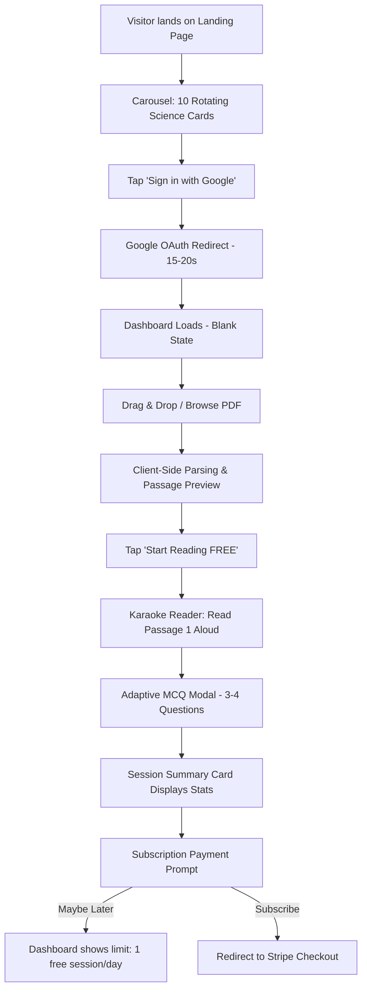
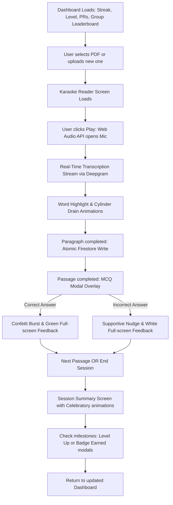
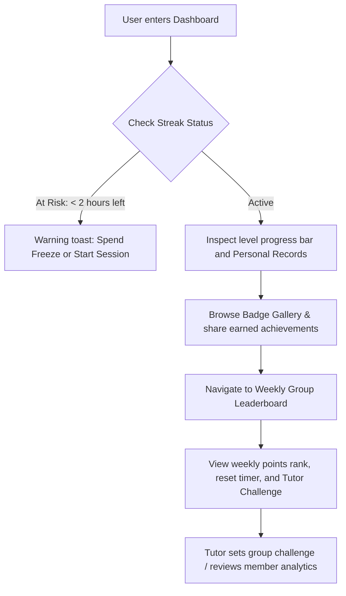

# RETREIVE Product & Architecture Analysis

This document provides a comprehensive analysis of the RETREIVE product requirements and documentation. RETREIVE is a mobile-first MCAT study platform that combines speech-based reading with real-time visual highlighting, adaptive MCQ quizzes, and robust gamified engagement loops to boost learning retention.

**Design Theme: Light Duolingo-Inspired (Single Theme — No Dark Mode)**

---

## 1. User Personas

### Persona A: "Re-taker Rebecca" (Primary User)
* **Demographics:** Age 24–30, US/Canada, completed one or two prior MCAT attempts, preparing for a retake.
* **Profile:** Dedicated but anxious pre-med student who feels burned out by traditional passive study methods (reading static PDFs, watching long lectures) which resulted in low retention.
* **Needs:** 
  * Differentiated, scientifically backed active study method (30–90 min blocks).
  * Low-cost study tool ($5/month vs. $1k+ traditional prep courses).
  * Ability to import custom PDFs, study notes, and transcripts.
  * Reliable session recovery (zero progress loss on network hiccups).
* **Motivations:** 
  * Admission to medical school.
  * Visual progress indicators (reading level progression, historical data).
  * Loss aversion hooks (maintaining a high daily streak).
* **Pain Points:** Spends 15+ hours/week studying but retains ~50% of the material; fears losing study momentum or streak data due to app crashes.

### Persona B: "Last-Minute Leo" (Secondary User)
* **Demographics:** Age 22–25, undergraduate student balancing coursework/part-time job, short preparation timeline.
* **Profile:** A busy student cramming for the MCAT who needs high efficiency and instant visual/auditory feedback to stay focused.
* **Needs:** 
  * Extremely low entry friction (onboarding to study in <2 minutes).
  * Mobile-first responsive interface for studying on commutes or during short breaks.
  * Daily mini-competitions and short-duration, high-impact sessions.
* **Motivations:** 
  * Beating weekly challenges set by peers or tutors.
  * Climbing group leaderboards to feel a sense of immediate winning.
  * Instant gratification (celebratory sounds, confetti on correct answers).
* **Pain Points:** Easily distracted by long, dense passages; has limited consecutive study hours; struggles to find instant motivation.

### Persona C: "Structured Sonia" (Tertiary User)
* **Demographics:** Age 26–32, long-term methodical prep, working with a tutor or study group.
* **Profile:** Data-driven learner who meticulously plans out schedules and demands concrete proof of retention and progress.
* **Needs:** 
  * Precise session analytics (transcription accuracy trends, MCQ performance breakdown).
  * Permanent progress logs showing competence-based milestones (Personal Records).
  * Integration with tutor workflows (letting tutors see stats, set custom challenges, and audit logs).
* **Motivations:** 
  * Unlocking higher skill badges (e.g., "Accuracy Ace", "Quiz Legend").
  * Systematically improving scores week-over-week.
  * Validating performance with tutors.
* **Pain Points:** Apprehensive of vague "better retention" claims; frustrated by disjointed study tools; requires seamless multi-device synchronization.

---

## 2. User Flows

### Flow A: Frictionless Onboarding & First-Time Study Session (Free Trial)


### Flow B: Student Study Session (Paid / Returning User)


### Flow C: Daily Engagement, Progress Sharing & Social Competition


---

## 3. Design System — Light Duolingo Theme

The application uses a **single light theme** inspired by Duolingo's playful, gamified, and accessible design language. There is no dark mode.

### Color Palette

| Token | Hex | Usage |
| :--- | :--- | :--- |
| `background` | `#FAFAF9` | Page canvas |
| `surface` | `#FFFFFF` | Cards, inputs, elevated containers |
| `surface-container` | `#EEEEEE` | Secondary backgrounds, section dividers |
| `surface-border` | `#E5E5E5` | Card borders, dividers |
| `primary` | `#58CC02` | Primary CTAs, active highlights, success states |
| `primary-dark` | `#2B6C00` | Primary text on light, hover states |
| `primary-container` | `#E8F9DB` | Light green tinted backgrounds |
| `secondary` | `#006590` | Secondary accent (links, info badges) |
| `secondary-container` | `#E0F5FF` | Light blue tinted backgrounds |
| `tertiary` | `#755B00` | Gold accent (streaks, achievements) |
| `tertiary-container` | `#FFF9E0` | Light gold tinted backgrounds |
| `error` | `#BA1A1A` | Error states, incorrect MCQ answers |
| `error-light` | `#FFDAD6` | Error background tint |
| `text-primary` | `#1A1C1C` | Headlines, body text |
| `text-secondary` | `#5F6A59` | Captions, metadata, labels |
| `text-tertiary` | `#A6A6A6` | Placeholder text, disabled states |

### Typography

| Level | Font | Size | Weight | Usage |
| :--- | :--- | :--- | :--- | :--- |
| `headline-xl` | Plus Jakarta Sans | 48px (36px mobile) | 800 | Hero headings |
| `headline-lg` | Plus Jakarta Sans | 32px (28px mobile) | 800 | Page titles |
| `headline-md` | Plus Jakarta Sans | 24px | 700 | Section headings |
| `body-lg` | Plus Jakarta Sans | 16px | 400 | Primary body text |
| `body-sm` | Plus Jakarta Sans | 14px | 400 | Secondary text, descriptions |
| `label-caps` | Inter | 12px / 600 | 600 | Uppercase metadata, tags |
| `karaoke-reading` | Plus Jakarta Sans | 22px | 400 | Reader passage text (line-height 1.6) |

### Button System (Duolingo 3D Style)

- **Primary:** `#58CC02` background, white text, `0 4px 0 0 #2B6C00` bottom shadow. On press: shadow drops to 0, button translates down 4px.
- **Secondary:** `#FFFFFF` background, `2px solid #E3E2E2` border, `0 4px 0 0 #E3E2E2` bottom shadow. Same press behavior.
- **Destructive:** `#BA1A1A` background, white text, `0 4px 0 0 #690005` bottom shadow.

### Shapes & Spacing

- **Border Radius:** 8px (cards), 12px (buttons, inputs), 16px (modals), 9999px (pills/chips)
- **Spacing Grid:** 8px rhythmic base. All margins/paddings are multiples of 8.
- **Touch Targets:** Minimum 48px for all interactive elements.

### Elevation & Depth

- **Cards:** White (`#FFFFFF`) background with `2px solid #E5E5E5` border. Hover: border transitions to `#58CC02`, card lifts `-12px` on Y axis.
- **Modals:** White background with `backdrop-filter: blur(8px)` scrim, large soft shadow.
- **No dark surfaces.** All containers are white or light gray. Hierarchy is achieved via border weight and tonal background tints (green-light, blue-light, gold-light).

---

## 4. Information Architecture

### Firestore Collections & Data Schema

```
/users/{userId}
  ├── name: string
  ├── email: string
  ├── createdAt: timestamp
  ├── hasPaid: boolean
  ├── freePdfToken: boolean
  ├── subscriptionStatus: string (active | cancelled | past_due)
  ├── stripeCustomerId: string
  ├── lastSessionId: string
  ├── streakCount: number
  ├── streakLastUpdated: timestamp
  ├── freezesRemaining: number
  ├── level: number
  ├── levelPoints: number
  └── personalRecords: map
        ├── highestAccuracy: number
        ├── highestMCQPercent: number
        ├── longestSessionSeconds: number
        └── mostWordsSession: number

/sessions/{sessionId}
  ├── userId: string (FK to users)
  ├── pdfName: string
  ├── pdfUrl: string (Storage path)
  ├── passages: array
  │     └── { index: number, text: string, tokenized: array, wordCount: number }
  ├── paragraphsCompleted: array (indices of completed paragraphs)
  ├── wordsRead: number
  ├── accuracy: number (0-100)
  ├── timeSpent: number (seconds)
  ├── progressPercent: number (0-100)
  ├── mcqResults: array
  │     └── { mcqId: string, selectedAnswer: string, correct: boolean, timestamp: timestamp }
  ├── createdAt: timestamp
  ├── updatedAt: timestamp
  └── completedAt: timestamp

/mcqs/{mcqId}
  ├── topic: string
  ├── question: string
  ├── options: array
  ├── correctAnswer: string
  ├── correctNudge: string
  ├── wrongNudge: string
  └── difficulty: string (easy | medium | hard)

/openingCards/{cardId}
  ├── id: string
  ├── title: string
  ├── body: string
  ├── emoji: string

/badges/{badgeId}
  ├── name: string
  ├── description: string
  ├── iconUrl: string
  └── conditionType: string

/studyGroups/{groupId}
  ├── name: string
  ├── tutorId: string
  ├── members: array (userIds)
  ├── inviteCode: string
  ├── weeklyPoints: map (userId -> number)
  └── activeChallengeId: string

/challenges/{challengeId}
  ├── groupId: string
  ├── title: string
  ├── description: string
  ├── targetWordCount: number
  └── badgeRewardId: string
```

### Access Control Matrix

| Role / Tier | Access Level | Permissions / Scope |
| :--- | :--- | :--- |
| **Guest (Unauthenticated)** | Public Pages Only | View `/` (Landing Page) & science cards carousel. |
| **Free Tier User** | Single PDF / Daily Limit | View `/dashboard` (Blank State), upload **1 PDF**, run **1 free Karaoke session** per 24h. No MCQ quizzes, streaks, levels, badges, or leaderboards. |
| **Paid Tier User ($5/mo)** | Full Access | Unlimited uploads, Karaoke reader with real-time Speech-to-Text highlighting, adaptive MCQ quizzes, Streaks/Freezes, Leveling, Badge Gallery, and Global/Private Leaderboards. |
| **Tutor / Educator** | Premium + Admin | All Paid Tier rights plus the ability to create study groups, invite students, configure weekly challenges, and review aggregated student performance analytics (including churn alerts). |

---

## 5. Sitemap

```
/ (Landing Page + Science Cards Carousel)
├── /signup (Frictionless Signup: Google OAuth, Email/Password, Phone OTP)
└── /checkout (Stripe Billing Gate - converts Free to Paid)
/dashboard (Main returning user interface)
├── /upload (PDF Upload & Preview modal)
├── /session/{sessionId} (Active Karaoke Reading environment)
│   ├── /session/{sessionId}/quiz (Adaptive MCQ overlay)
│   └── /session/{sessionId}/summary (End-of-session Stats and Celebrations)
├── /leaderboard (Global and private Study Group rankings)
├── /badges (Personal Badge Gallery and sharing triggers)
└── /settings (Account, subscription portal, font customizer)
/tutor/dashboard (Tutor-only cohort statistics, challenge manager, and group administration)
```

---

## 6. MVP Feature List

### Core MVP Features (Must-Haves)
1. **Frictionless Google OAuth:** Instant single-tap registration and automatic profile provisioning, skipping welcome wizards.
2. **Opening Science Carousel:** 10 rotating cards illustrating the neuroscience value of speech-backed reading to validate learning effectiveness during onboarding.
3. **Client-side PDF Extraction:** pdf.js integrated locally to extract text and segment documents into ~300-word passages within 2 seconds.
4. **Stripe payment gate:** Secure Stripe checkout flow generating monthly recurring subscriptions ($5/mo) dynamically upon PDF confirmation.
5. **Karaoke Reader Speech Engine:** Real-time word-by-word matching and visual highlights backed by Deepgram WebSockets with ephemeral token security.
6. **Visual Progress Cylinder:** Animated CSS cylinder indicating completion status that only drains when speech activity is actively detected.
7. **Per-Paragraph Persistence:** Immutable Firestore saves triggered at the end of each paragraph to prevent study progress data loss.
8. **MCQ Quizzes:** 3–4 context-aware MCQs shown in a modal at the end of each passage. Correct answers trigger green screens; incorrect answers show explanations (nudges) on white screens.
9. **Basic Session Summary:** Direct post-session card detailing words read, accuracy %, duration, and MCQ percentage.

### Engagement Features (Phase 1 / Post-MVP)
10. **Daily Streak Engine:** Flame badge tracker resetting at UTC boundaries, complete with countdowns and buyable Streak Freezes ($0.99) when free allocations (2/month) run dry.
11. **Reading Levels & XP:** Infinite leveling progression based on words read, with XP multipliers for accuracy streaks (e.g., +15 XP for 98% accuracy).
12. **Personal Records (PRs):** High score log tracking 5 key metrics, displaying live PR-broken toasts post-session.
13. **Study Group Leaderboard:** Weekly, points-based leaderboard resetting Sundays with tied-rank handling (T-1, T-2).
14. **Weekly Challenges:** Tutor-generated reading milestones that award custom profile badges upon completion.
15. **Badge Gallery:** Grayscale-to-color gallery displaying 30+ earned/locked achievement badges with clipboard sharing support.
16. **Animations & Haptics:** Particle sparkles on speech matches, full-screen shimmers on level-ups, haptic feedback pulses on mobile speech recognition.
17. **Animated Mascot Companion:** Optional animated companion (fox/robot) that reacts contextually to user session states (can be disabled).
18. **Customization Panel:** Adjustable reader font sizes (16pt–24pt), and toggles for mascot and sound effects.

---

## 7. Screen Inventory

| Screen # | Page / Modal | Route / Location | Status | Primary Purpose | Responsive Details |
| :--- | :--- | :--- | :--- | :--- | :--- |
| **Screen 1** | Page | `/` | ✅ Built | Onboarding/Landing page showing the auto-advancing 10 Science Cards carousel and CTA to sign up. | Card scales; dots collapse into side navigator on mobile landscape. |
| **Screen 2** | Page | `/auth/signup` | ✅ Built | Frictionless signup page featuring dominant Google OAuth button and collapsing fields for Email & Phone options. | Stacked inputs; touch targets are minimum 48px. |
| **Screen 3** | Page | `/auth/signin` | ✅ Built | Returning user login page with Google OAuth and email/password. | Stacked inputs; responsive layout. |
| **Screen 4** | Page | `/dashboard` | ✅ Built | Returning user page displaying streak counts, level progress bar, PRs, earned badges carousel, and study group preview. Blank state for new users. | Vertical stacked layout; compact group ranks table. |
| **Screen 5** | Page | `/upload` | ✅ Built | Visual progress bar of parsing PDF text, displaying segmented passages, word counts, and a start action button. | Limit container height on mobile; scrolling preview. |
| **Screen 6** | Redirect | Stripe Hosted | ✅ Built | Processing user card transactions for subscription verification. | Managed by Stripe; fully mobile responsive. |
| **Screen 7** | Page | `/reader` | ✅ Built | Karaoke reading dashboard. Features large text, left navigation sidebar, and right progress cylinder. | Collapses left navigation; reduces right cylinder scale on mobile. |
| **Screen 8** | Page | `/quiz` | ✅ Built | 3–4 multiple choice questions shown one-by-one. Triggers full-screen green/white answer validation overlays. | Vertical buttons stack; text auto-scales. |
| **Screen 9** | Page | `/summary` | ✅ Built | Post-session analytics showing words read, duration, accuracy, MCQ success, and celebration animations. | Grid elements collapse from 4-columns to a single column. |
| **Screen 10** | Page | `/leaderboard` | ✅ Built | Global and study group rankings list (Rank, Name, Points, Streak, Level, Active). Displays active tutor challenges. | Condenses table columns; horizontal scroll. |
| **Screen 11** | Page | `/badges` | ✅ Built | Badge showcase showing illuminated earned badges and locked achievements. | Flex grid reflowing items based on screen width. |
| **Screen 12** | Page | `/profile` | ✅ Built | User profile with stats overview and personal records. | Responsive single-column layout. |
| **Screen 13** | Page | `/settings` | ❌ Missing | Font size slider (16pt–24pt), mascot toggle, sound effects toggle, subscription management (cancel/resubscribe via Stripe portal), account deletion with confirmation. | Touch-friendly switches; horizontal slider inputs. |
| **Screen 14** | Page | `/tutor/dashboard` | ❌ Missing | Tutor portal containing group metrics, active challenge configurators, student performance analytics, and inactive member warnings. | Tables scroll horizontally; charts scale dynamically. |

---

## 8. Stitch Prompts for Missing Pages

Use these prompts with the **Stitch `generate_screen_from_text`** tool, targeting the existing **"RETREIVE — Landing Page"** project (project ID: `14447674757952374663`) which already uses the light Duolingo design system.

---

### Prompt 1: Settings Page (`/settings`)

```
Design a Settings page for the RETREIVE MCAT study app.

**Layout:** Single centered column (max-width 640px) on a #FAFAF9 background. A sticky top bar with a back arrow and "Settings" title in Plus Jakarta Sans 24px/700.

**Sections (each in a white card with 2px #E5E5E5 border, 8px radius):**

1. **Reading Preferences**
   - "Font Size" label with a horizontal slider (16pt–24pt) showing a live preview sentence: "The mitochondria is the powerhouse of the cell." The preview text resizes as the slider moves.
   - "Mascot Companion" toggle switch (Duolingo green #58CC02 when on) with a small fox icon and description: "Show animated study buddy during sessions"
   - "Sound Effects" toggle switch with speaker icon and description: "Play celebration sounds on correct answers"

2. **Subscription**
   - Show current plan: "RETREIVE Pro — $5/month" with a green badge "Active"
   - "Manage Subscription" button (secondary style: white bg, #E5E5E5 border, 4px bottom shadow) that links to Stripe portal
   - "Next billing date: July 5, 2026" in text-secondary color

3. **Account**
   - User email displayed as read-only with a lock icon
   - "Sign Out" button (secondary style)
   - "Delete Account" button (destructive style: #BA1A1A background, white text, 4px #690005 bottom shadow) with a warning note below: "This action is permanent and cannot be undone."

**Style:** Light, clean, Duolingo-inspired. All toggle switches use the 3D tactile style with 4px bottom shadows. Section headers use 12px/600 Inter uppercase with #5F6A59 color. No dark mode elements anywhere.
```

---

### Prompt 2: Tutor Dashboard (`/tutor/dashboard`)

```
Design a Tutor Dashboard page for the RETREIVE MCAT study app.

**Layout:** Full-width page on #FAFAF9 background with a left sidebar (240px, white, border-right #E5E5E5) containing navigation: Dashboard (active, green highlight), My Groups, Challenges, Analytics. Main content area with 32px padding.

**Top Section:**
- Welcome header: "Welcome back, Dr. Smith" in Plus Jakarta Sans 32px/800
- Subtitle: "3 active study groups · 47 students" in #5F6A59
- "Create New Group" primary button (green #58CC02, white text, 3D shadow)

**Stats Row (4 cards in a horizontal grid):**
- "Total Students" — 47 with a green up-arrow +5 this week
- "Avg. Accuracy" — 78.3% with a small progress bar
- "Active Streaks" — 32/47 students with flame emoji
- "Sessions This Week" — 156 with a blue chart icon
Each card: white background, 2px #E5E5E5 border, 8px radius, number in 32px/800 Plus Jakarta Sans

**Study Groups Table (main content):**
White card with header "My Study Groups" and a search input.
Table columns: Group Name, Members, Avg. Level, Weekly Points, Active Challenge, Status.
Sample rows:
- "Bio 301 — Fall Cohort" | 18 members | Lvl 12 | 4,230 pts | "Read 5,000 words" | Green "Active" badge
- "Organic Chemistry Review" | 15 members | Lvl 8 | 2,891 pts | "90% Quiz Accuracy" | Green "Active" badge  
- "Physics Fundamentals" | 14 members | Lvl 6 | 1,456 pts | None | Gold "Needs Challenge" badge

**Bottom Section — At-Risk Students Alert:**
A card with a subtle #FFF9E0 (gold-light) background and #755B00 border-left (4px).
Header: "⚠️ Inactive Students (5)" 
List of student names with "Last active: 3 days ago" in red (#BA1A1A) text and a "Send Nudge" secondary button next to each.

**Style:** Light Duolingo-inspired gamified aesthetic. All cards have the tactile 2px border style. Badges use pill shapes with colored backgrounds (green-light for active, gold-light for warnings). No dark mode. Use the same Plus Jakarta Sans + Inter type system.
```

---

## 9. CSS Theme Reference (globals.css)

The `globals.css` should enforce the light-only theme. Key directives:

```css
html {
  scroll-behavior: smooth;
  color-scheme: light;  /* Light only — no dark mode */
}

body {
  background-color: #FAFAF9;
  color: #1A1C1C;
  font-family: 'Plus Jakarta Sans', -apple-system, sans-serif;
}

/* Scrollbar */
::-webkit-scrollbar-thumb {
  background: #58CC02;
}

/* Focus */
*:focus-visible {
  outline: 2px solid #58CC02;
}

/* Duolingo 3D Buttons */
.primary-btn {
  background-color: #58cc02;
  box-shadow: 0 4px 0 0 #2b6c00;
}

.secondary-btn {
  background-color: #ffffff;
  border: 2px solid #e3e2e2;
  box-shadow: 0 4px 0 0 #e3e2e2;
}

/* Cards */
.hover-card {
  background: #ffffff;
  border: 2px solid #E5E5E5;
}
.hover-card:hover {
  border-color: #58cc02;
}

/* No glass-morphism, no dark surfaces, no neon glows */
```
